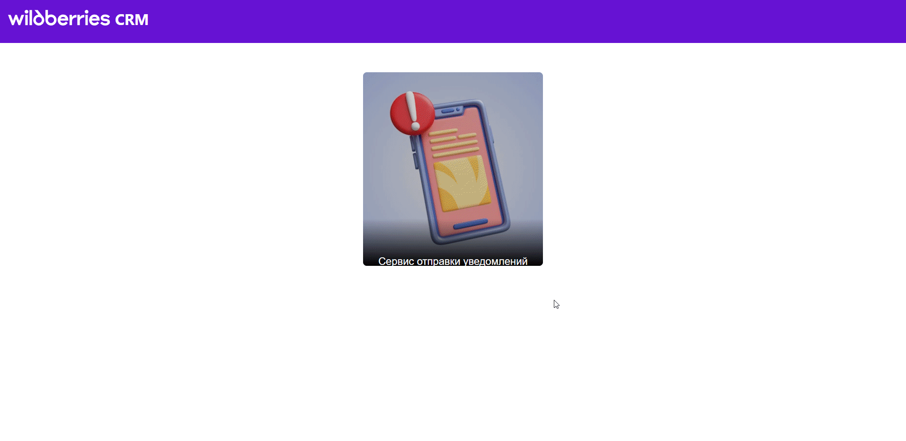
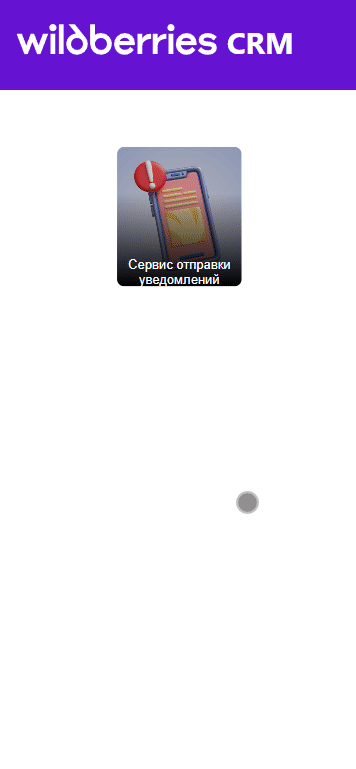

# Frontend WB CRM для сервиса нотификации

Frontend WB CRM — это веб-приложение для управления CRM в рамках стилистики сайта Wildberries. Проект предоставляет удобный интерфейс для создания уведомлений, просмотра выполненных уведомлений.

## 📽️ Превью приложения


## 📽️ Превью приложения в мобильной версии


## Основные функции

- **Создание уведомлений**:
    - Добавление заголовка, ссылки и сообщения.
    - Возможность отправки уведомлений по User ID или через CSV-файл.
- **Управление данными**:
    - Загрузка CSV-файлов для массовой обработки.
    - Валидациция CSV-файла на корректный формат.
    - Ввод User ID вручную.
- **Модальные окна**:
    - Уведомления об успешной отправке данных.
    - Уведомления об некорректном формате загруженного файла.

    
## Установка и запуск

Для запуска проекта локально выполните следующие шаги:

1. **Клонируйте репозиторий**:
   ```bash
   git clone https://github.com/mrSvin/Frontend_WB_CRM.git
   cd Frontend_WB_CRM

2. **Запустите проект одним из способов**:   
    1. Через пакет nmp с помощью команд
   ```bash
    npm install
    npm start     
    ```   
    2. Через Docker контейнер с помощью команды (при наличие в системе Docker)
   ```bash
    docker-compose up -d   
    ```  
    3. Через команду make (при наличие в системе Docker и make в переменном окружении)
   ```bash
    make up  
    ```  
3. **Запустите контейнеры backend сервиса с БД согласно инструкции "Установка и запуск" по ссылке**
   https://github.com/mrSvin/Go_back_Wb_CrmNotifications


4. **Откройте проект по адресу http://localhost:3000/**:     